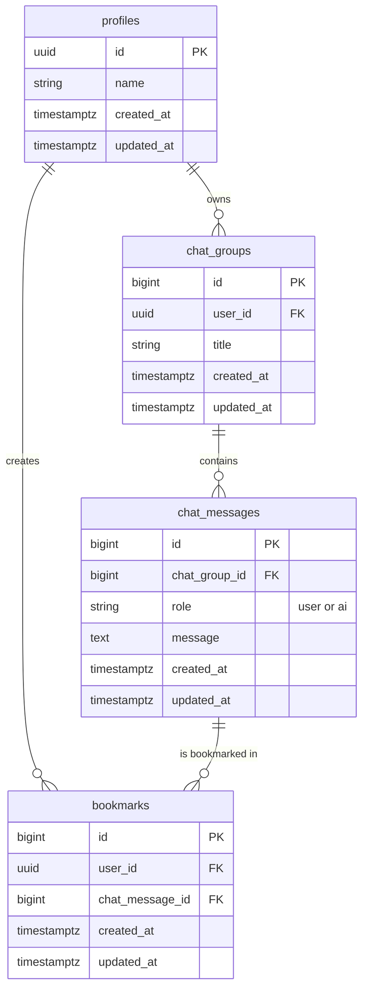

# API 設計書：AI チャット英語学習システム

## 1. はじめに

本ドキュメントは、「AI チャット英語学習システム」のバックエンド API について、その仕様を定義するものです。
`documents/要件定義書.md` に基づき、必要なエンドポイント、リクエスト、レスポンス形式などを定めます。

本システムではバックエンドの実装に Next.js の Server Actions を採用します。そのため、本ドキュメントで定義する「API エンドポイント」は、厳密な REST API のエンドポイントではなく、クライアントから呼び出されるサーバー上の関数（アクション）に対応します。設計の明確化のため、ここでは RESTful な表現を用いて記述します。

## 2. 認証

本システムのすべての API は、ユーザー認証を必要とします。認証は [Supabase Auth](https://supabase.com/docs/guides/auth) を用いて行います。

クライアントは、Supabase から取得した JWT (JSON Web Token) を、各リクエストの `Authorization` ヘッダーに `Bearer` トークンとして付与する必要があります。サーバー側では、このトークンを検証し、リクエストが正当なユーザーからのものであることを確認します。

```
Authorization: Bearer <SUPABASE_JWT>
```

## 3. エンドポイント一覧

| HTTP メソッド | パス                  | 機能概要             | 備考                                   |
| :------------ | :-------------------- | :------------------- | :------------------------------------- |
| `POST`        | `/api/chat`           | AI とのチャット      | Vercel AI SDK を利用したストリーミング |
| `GET`         | `/api/bookmarks`      | ブックマーク一覧取得 |                                        |
| `POST`        | `/api/bookmarks`      | ブックマーク作成     |                                        |
| `DELETE`      | `/api/bookmarks/{id}` | ブックマーク削除     |                                        |

---

## 4. エンドポイント詳細

### 4.1. チャット

ユーザーからのメッセージを元に、AI が学習用の提案を生成して返します。レスポンスはストリーミング形式で返却されます。

- **メソッド**: `POST`
- **パス**: `/api/chat`
- **説明**: Vercel AI SDK の `useChat` フック等を利用してクライアントから呼び出されることを想定しています。バックエンドでは、ユーザーのメッセージと AI からの回答を`chat_messages`テーブルに保存します。

**リクエストボディ (`application/json`)**

```json
{
  "messages": [
    {
      "role": "user",
      "content": "会議で使える丁寧な表現を教えて"
    }
    // ...過去の会話履歴
  ]
}
```

**レスポンス (成功時: `200 OK`, `text/plain`)**

AI によって生成されたテキストがストリーミング形式で返されます。Vercel AI SDK がレスポンスを処理し、クライアント側でチャットメッセージとして整形します。
生成されたメッセージは DB の `chat_messages` テーブルに保存され、ユーザーはそのメッセージをブックマークできます。

**レスポンス (失敗時)**

| ステータスコード            | 説明               |
| :-------------------------- | :----------------- |
| `401 Unauthorized`          | 認証エラー         |
| `500 Internal Server Error` | サーバー内部エラー |

---

### 4.2. ブックマーク一覧取得

認証済みユーザーが保存したブックマークの一覧を取得します。内部的に`bookmarks`テーブルと`chat_messages`テーブルを JOIN して必要な情報を取得します。

- **メソッド**: `GET`
- **パス**: `/api/bookmarks`

**レスポンス (成功時: `200 OK`)**

```json
[
  {
    "id": 1,
    "message": "Could you please elaborate on that point?\nその点について、もう少し詳しく説明していただけますか？",
    "created_at": "2023-10-27T10:00:00Z"
  },
  {
    "id": 2,
    "message": "I think that's a fantastic idea.\nそれは素晴らしいアイデアだと思います。",
    "created_at": "2023-10-26T15:30:00Z"
  }
]
```

> `id` は `bookmarks.id` を表します。削除処理に使用します。

**レスポンス (失敗時)**

| ステータスコード            | 説明               |
| :-------------------------- | :----------------- |
| `401 Unauthorized`          | 認証エラー         |
| `500 Internal Server Error` | サーバー内部エラー |

---

### 4.3. ブックマーク作成

AI が生成したチャットメッセージをブックマークとして保存します。

- **メソッド**: `POST`
- **パス**: `/api/bookmarks`

**リクエストボディ (`application/json`)**

```json
{
  "chat_message_id": 123
}
```

**レスポンス (成功時: `201 Created`)**

作成されたブックマークオブジェクトが返されます。

```json
{
  "id": 1,
  "user_id": "a0b1c2d3-e4f5-a6b7-c8d9-e0f1a2b3c4d5",
  "chat_message_id": 123,
  "created_at": "2023-10-27T12:00:00Z",
  "updated_at": "2023-10-27T12:00:00Z"
}
```

**レスポンス (失敗時)**

| ステータスコード            | 説明                   |
| :-------------------------- | :--------------------- |
| `400 Bad Request`           | リクエストボディが不正 |
| `401 Unauthorized`          | 認証エラー             |
| `500 Internal Server Error` | サーバー内部エラー     |

---

### 4.4. ブックマーク削除

指定された ID のブックマークを削除します。

- **メソッド**: `DELETE`
- **パス**: `/api/bookmarks/{id}`

**パスパラメータ**

| パラメータ | 型       | 説明                                       |
| :--------- | :------- | :----------------------------------------- |
| `id`       | `BIGINT` | 削除するブックマークの ID (`bookmarks.id`) |

**レスポンス (成功時: `204 No Content`)**

レスポンスボディはありません。

**レスポンス (失敗時)**

| ステータスコード            | 説明                                             |
| :-------------------------- | :----------------------------------------------- |
| `401 Unauthorized`          | 認証エラー                                       |
| `403 Forbidden`             | 他のユーザーのブックマークを削除しようとした場合 |
| `404 Not Found`             | 指定された ID のブックマークが存在しない場合     |
| `500 Internal Server Error` | サーバー内部エラー                               |

---

## 5. データモデル (Supabase)

`DB設計書.md`に基づき、データベースの構造を以下に定義します。

### 5.1. ER 図



### 5.2. テーブル定義

#### 5.2.1. `profiles` テーブル

Supabase の認証ユーザー (`auth.users`) に紐づく、アプリケーション固有のユーザー情報を格納します。

| カラム名     | データ型       | 制約                                                         | 説明                                                                                    |
| :----------- | :------------- | :----------------------------------------------------------- | :-------------------------------------------------------------------------------------- |
| `id`         | `UUID`         | `PRIMARY KEY`, `REFERENCES auth.users(id) ON DELETE CASCADE` | `auth.users` テーブルの ID を参照する。ユーザー削除時にプロフィールも自動で削除される。 |
| `name`       | `VARCHAR(255)` |                                                              | ユーザーの表示名                                                                        |
| `created_at` | `TIMESTAMPTZ`  | `NOT NULL`, `DEFAULT now()`                                  | 作成日時                                                                                |
| `updated_at` | `TIMESTAMPTZ`  | `NOT NULL`, `DEFAULT now()`                                  | 更新日時                                                                                |

#### 5.2.2. `chat_groups` テーブル

チャット会話のグループを管理します。ユーザーは複数のチャットグループを持つことができます。

| カラム名     | データ型       | 制約                                              | 説明                                                             |
| :----------- | :------------- | :------------------------------------------------ | :--------------------------------------------------------------- |
| `id`         | `BIGINT`       | `PRIMARY KEY`, `GENERATED BY DEFAULT AS IDENTITY` | チャットグループを一意に識別する ID                              |
| `user_id`    | `UUID`         | `FK (auth.users.id)`, `NOT NULL`                  | チャットグループの所有者であるユーザーの ID                      |
| `title`      | `VARCHAR(255)` |                                                   | チャットグループのタイトル（例：「英会話練習」「ビジネス英語」） |
| `created_at` | `TIMESTAMPTZ`  | `NOT NULL`, `DEFAULT now()`                       | 作成日時                                                         |
| `updated_at` | `TIMESTAMPTZ`  | `NOT NULL`, `DEFAULT now()`                       | 更新日時                                                         |

#### 5.2.3. `chat_messages` テーブル

特定のチャットグループ内でのユーザーと AI の対話履歴を格納します。

| カラム名        | データ型      | 制約                                              | 説明                                    |
| :-------------- | :------------ | :------------------------------------------------ | :-------------------------------------- |
| `id`            | `BIGINT`      | `PRIMARY KEY`, `GENERATED BY DEFAULT AS IDENTITY` | メッセージを一意に識別する ID           |
| `chat_group_id` | `BIGINT`      | `FK (chat_groups.id)`, `NOT NULL`                 | メッセージが属するチャットグループの ID |
| `role`          | `VARCHAR(50)` | `NOT NULL`                                        | 発言者の役割 (`'user'` or `'ai'`)       |
| `message`       | `TEXT`        | `NOT NULL`                                        | メッセージ本文                          |
| `created_at`    | `TIMESTAMPTZ` | `NOT NULL`, `DEFAULT now()`                       | 作成日時                                |
| `updated_at`    | `TIMESTAMPTZ` | `NOT NULL`, `DEFAULT now()`                       | 更新日時                                |

#### 5.2.4. `bookmarks` テーブル

ユーザーがブックマークしたチャットメッセージを管理します。`profiles` テーブルと `chat_messages` テーブルの中間テーブルとして機能します。

| カラム名          | データ型      | 制約                                              | 説明                                                       |
| :---------------- | :------------ | :------------------------------------------------ | :--------------------------------------------------------- |
| `id`              | `BIGINT`      | `PRIMARY KEY`, `GENERATED BY DEFAULT AS IDENTITY` | ブックマークを一意に識別する ID                            |
| `user_id`         | `UUID`        | `FK (auth.users.id)`, `NOT NULL`                  | ブックマークしたユーザーの ID                              |
| `chat_message_id` | `BIGINT`      | `FK (chat_messages.id)`, `NOT NULL`               | ブックマークされたチャットメッセージの ID                  |
| `created_at`      | `TIMESTAMPTZ` | `NOT NULL`, `DEFAULT now()`                       | 作成日時                                                   |
| `updated_at`      | `TIMESTAMPTZ` | `NOT NULL`, `DEFAULT now()`                       | 更新日時                                                   |
|                   |               | `UNIQUE (user_id, chat_message_id)`               | ユーザーは同じチャットメッセージを複数ブックマークできない |

### 5.3. ポリシー (Row Level Security)

テーブルごとに適切な行レベルセキュリティ (RLS) ポリシーを設定し、ユーザーが自身のデータにのみアクセスできるように制御します。

- ユーザーは自身の `user_id` と一致する行、またはそれに関連する行 (`chat_groups`, `chat_messages`, `bookmarks`) のみ `SELECT`, `INSERT`, `UPDATE`, `DELETE` できるように設定します。
