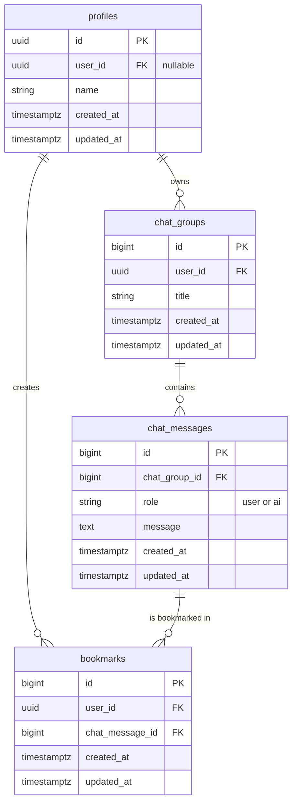

# DB 設計書

本ドキュメントは、AI チャット英語学習システムのデータベース設計を定義します。
`要件定義書.md` に基づき、システムが必要とするデータを永続化するためのテーブル構造を設計します。

## 1. 設計思想

- **正規化**: データの冗長性を排除し、一貫性を保つために正規化を意識した設計とします。
- **拡張性**: 将来的な機能追加（多言語対応、複数ユーザー対応など）を考慮し、スケールしやすい構造を目指します。
- **シンプルさ**: 初期開発においては、要件を過不足なく満たすシンプルな設計を心がけます。

## 2. ER 図

## 3. テーブル定義

### 3.1. `profiles` テーブル

Supabase の認証ユーザー (`auth.users`) に紐づく、アプリケーション固有のユーザー情報を格納します。

| カラム名     | データ型       | 制約                                          | 説明                                                                                    |
| :----------- | :------------- | :-------------------------------------------- | :-------------------------------------------------------------------------------------- |
| `id`         | `UUID`         | `PRIMARY KEY`, `DEFAULT gen_random_uuid()`    | プロフィールを一意に識別する ID                                                         |
| `user_id`    | `UUID`         | `REFERENCES auth.users(id) ON DELETE CASCADE` | `auth.users` テーブルの ID を参照する。ユーザー削除時にプロフィールも自動で削除される。 |
| `name`       | `VARCHAR(255)` |                                               | ユーザーの表示名                                                                        |
| `created_at` | `TIMESTAMPTZ`  | `NOT NULL`, `DEFAULT now()`                   | 作成日時                                                                                |
| `updated_at` | `TIMESTAMPTZ`  | `NOT NULL`, `DEFAULT now()`                   | 更新日時                                                                                |

### 3.2. `chat_groups` テーブル

チャット会話のグループを管理します。ユーザーは複数のチャットグループを持つことができます。

| カラム名     | データ型       | 制約                                              | 説明                                                             |
| :----------- | :------------- | :------------------------------------------------ | :--------------------------------------------------------------- |
| `id`         | `BIGINT`       | `PRIMARY KEY`, `GENERATED BY DEFAULT AS IDENTITY` | チャットグループを一意に識別する ID                              |
| `user_id`    | `UUID`         | `FK (auth.users.id)`, `NOT NULL`                  | チャットグループの所有者であるユーザーの ID                      |
| `title`      | `VARCHAR(255)` |                                                   | チャットグループのタイトル（例：「英会話練習」「ビジネス英語」） |
| `created_at` | `TIMESTAMPTZ`  | `NOT NULL`, `DEFAULT now()`                       | 作成日時                                                         |
| `updated_at` | `TIMESTAMPTZ`  | `NOT NULL`, `DEFAULT now()`                       | 更新日時                                                         |

### 3.3. `chat_messages` テーブル

特定のチャットグループ内でのユーザーと AI の対話履歴を格納します。

| カラム名        | データ型      | 制約                                              | 説明                                    |
| :-------------- | :------------ | :------------------------------------------------ | :-------------------------------------- |
| `id`            | `BIGINT`      | `PRIMARY KEY`, `GENERATED BY DEFAULT AS IDENTITY` | メッセージを一意に識別する ID           |
| `chat_group_id` | `BIGINT`      | `FK (chat_groups.id)`, `NOT NULL`                 | メッセージが属するチャットグループの ID |
| `role`          | `VARCHAR(50)` | `NOT NULL`                                        | 発言者の役割 (`'user'` or `'ai'`)       |
| `message`       | `TEXT`        | `NOT NULL`                                        | メッセージ本文                          |
| `created_at`    | `TIMESTAMPTZ` | `NOT NULL`, `DEFAULT now()`                       | 作成日時                                |
| `updated_at`    | `TIMESTAMPTZ` | `NOT NULL`, `DEFAULT now()`                       | 更新日時                                |

### 3.4. `bookmarks` テーブル

ユーザーがブックマークしたチャットメッセージを管理します。`profiles` テーブルと `chat_messages` テーブルの中間テーブルとして機能します。

| カラム名          | データ型      | 制約                                              | 説明                                                       |
| :---------------- | :------------ | :------------------------------------------------ | :--------------------------------------------------------- |
| `id`              | `BIGINT`      | `PRIMARY KEY`, `GENERATED BY DEFAULT AS IDENTITY` | ブックマークを一意に識別する ID                            |
| `user_id`         | `UUID`        | `FK (auth.users.id)`, `NOT NULL`                  | ブックマークしたユーザーの ID                              |
| `chat_message_id` | `BIGINT`      | `FK (chat_messages.id)`, `NOT NULL`               | ブックマークされたチャットメッセージの ID                  |
| `created_at`      | `TIMESTAMPTZ` | `NOT NULL`, `DEFAULT now()`                       | 作成日時                                                   |
| `updated_at`      | `TIMESTAMPTZ` | `NOT NULL`, `DEFAULT now()`                       | 更新日時                                                   |
|                   |               | `UNIQUE (user_id, chat_message_id)`               | ユーザーは同じチャットメッセージを複数ブックマークできない |

## 4. 主要な変更点

### 4.1. チャットグループの導入

- `chat_groups` テーブルを新設し、ユーザーが複数の独立したチャット会話を管理できるようになりました。
- `chat_messages` テーブルは `user_id` の代わりに `chat_group_id` を参照するように変更されました。

### 4.2. ブックマーク機能の簡素化

- `suggestions` テーブルを削除し、ブックマーク機能を簡素化しました。
- `bookmarks` テーブルが `chat_messages` を直接参照するようになり、より直感的な設計になりました。

### 4.3. データの階層構造

変更後：`profiles` → `chat_groups` → `chat_messages` ← `bookmarks`

この変更により、以下のメリットが得られます：

- **会話の分離**: トピック別や目的別にチャットを分けて管理可能
- **スケーラビリティ**: 大量のメッセージを効率的に管理
- **ユーザビリティ**: 過去の会話履歴を整理して検索しやすく
- **シンプルさ**: ブックマーク機能がより直感的に

### 4.4. マイグレーション戦略

既存データがある場合は、以下の手順でマイグレーションを行います：

1. `chat_groups` テーブルを作成
2. 既存の各ユーザーに対してデフォルトのチャットグループを作成
3. `chat_messages` テーブルに `chat_group_id` カラムを追加
4. 既存のメッセージをデフォルトグループに関連付け
5. `chat_messages` テーブルから `user_id` カラムを削除
6. `suggestions` テーブルを削除
7. `bookmarks` テーブルを再作成し、`chat_message_id` で直接参照するように変更
